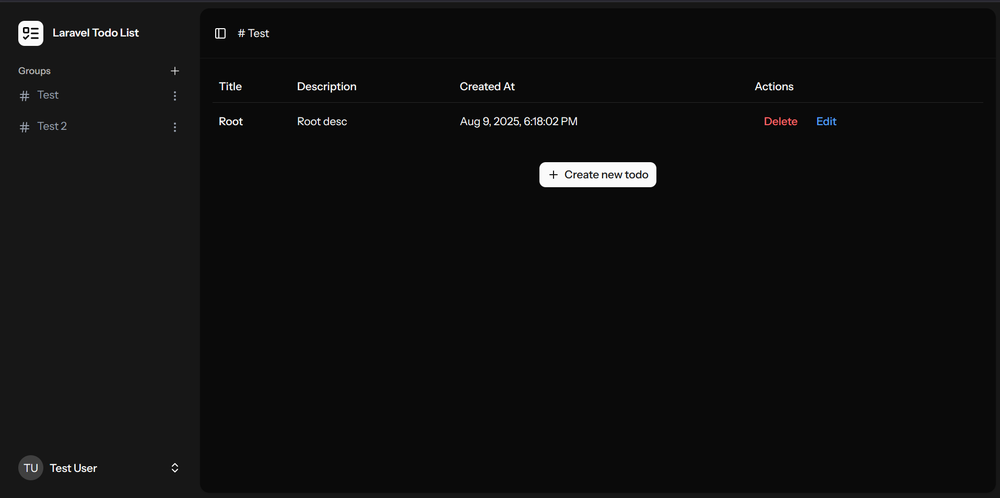

# 📝 Todo Management App  

**A Laravel + React task management system with nested todos, groups, and real-time UI interactions.**  



---

## ✨ Features  
- ✅ **Nested Todo Management** - Full CRUD operations with hierarchical organization  
- 📂 **Group System** - Create, rename, and delete task groups  
- ✏️ **Inline Editing** - Edit todos/groups via intuitive modal dialogs  
- 🗑️ **Safe Deletion** - Confirmation dialogs prevent accidental data loss  
- 🍞 **Smart Breadcrumbs** - Ellipsis truncation for long paths (commit `8d79733`)  
- 💬 **Toast Notifications** - User feedback for actions (commit `026f157`)  
- 🎨 **Interactive UI** - Hover effects, dropdown menus, and responsive dialogs  

---

## 🛠️ Tech Stack  
| Layer        | Technology              |
|--------------|-------------------------|
| **Backend**  | Laravel 12 (PHP)        |
| **Frontend** | React 19 + Inertia.js   |
| **Styling**  | Tailwind CSS + Headless UI |
| **Database** | MySQL/SQLITE (with seeders)     |
| **Build**    | Vite                    |

---

## 🚀 Quick Start  
1. **Clone & Install**  
   ```bash
   git clone https://github.com/your-repo/todo-app.git
   cd todo-app
   composer install && npm install
   ```
2. **Configure Environment**
    ```bash
    cp .env.example .env
    # Update DB credentials in .env
    ```

3. **Initialize Database**
    ```bash
    php artisan migrate --seed
    ```

4. **Run Development Servers**
    ```bash
    php artisan serve
    npm run dev
    ```

---

## 📜 License

MIT License © 2023 [Your Name]